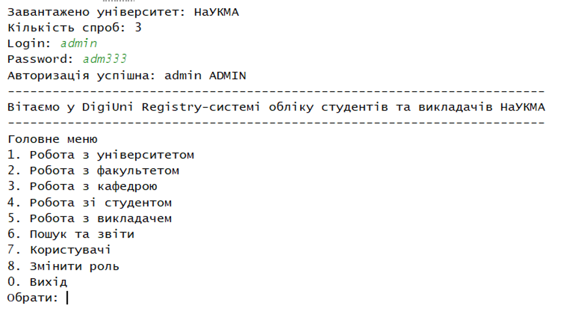
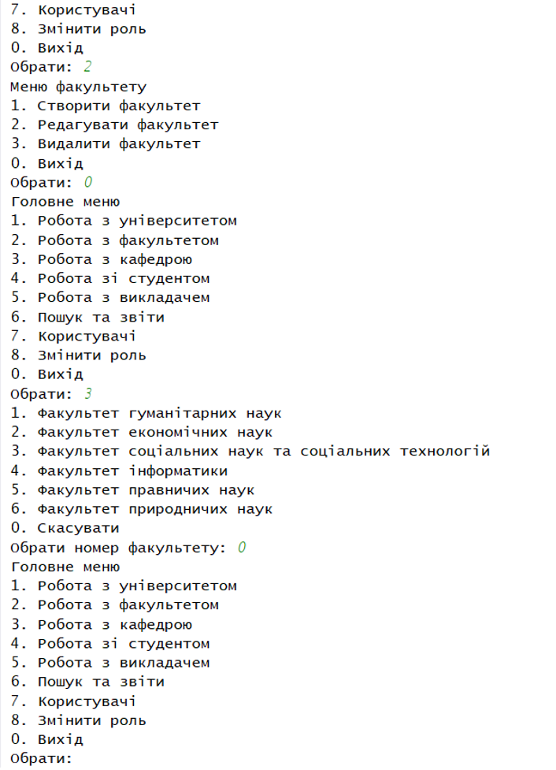
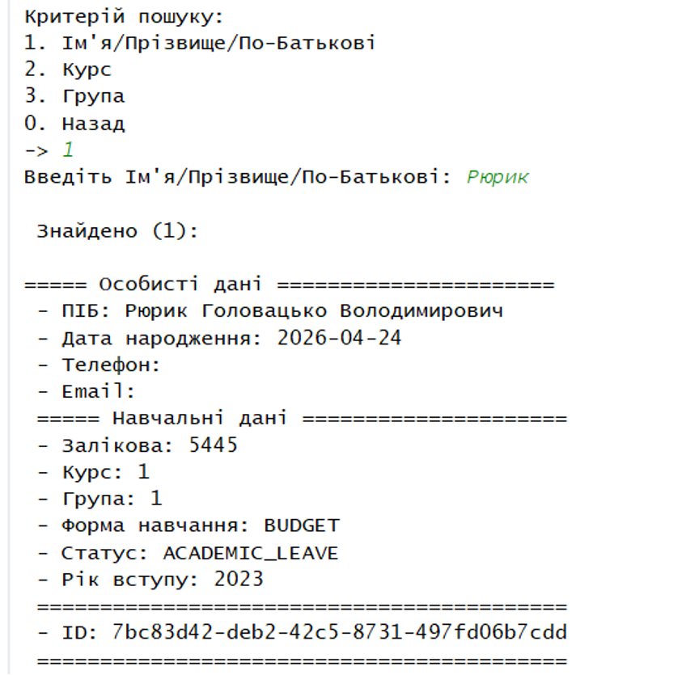
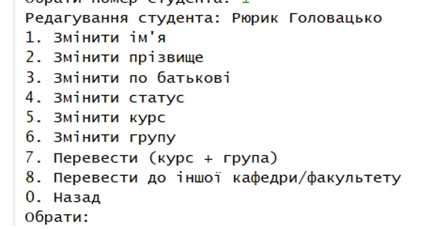
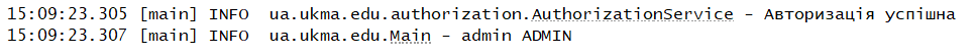
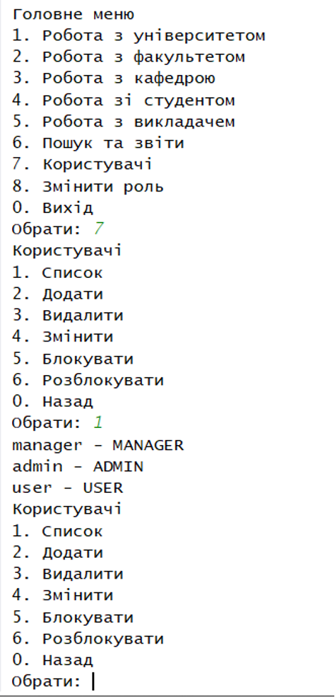

#  Lab work for ASD course. 
Authors: Ващук Микола & Бурмецька Вероніка

### **Інструкція користування**(опис можливостей системи)

Нижче наведено основний функціонал програми: 

Під час запуску програми є можливість авторизації з трьома різними ролями: admin, manager, user:

Після авторизації, з’являється меню з доступними діями. 

Інтерфейс програми реалізовано у вигляді ієрархічного меню з багаторівневою структурою. Відображення та доступ до окремих розділів чи функцій динамічно регулюється відповідно до прав авторизованої ролі користувача:

Використання Stream API дозволяє миттєво знайти студента\викладача за ПІБ або групою, курсом:

 
Є можливість переведення студента між курсами/групами та факультетами/кафедрами:

 
Логування через SLF4J + Log4j2:

 
Виведення/додавання/видалення/редагування/блокування/розблокування користувачей та ролей(тільки ADMIN):

 
Реалізовано збереження на виході з програми і автозбереження. Дані серіалізуються на диск за допомогою NIO.2 у файл data/university.bin. 
